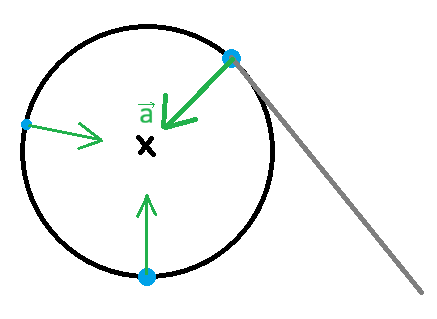

# Circular motion

If we are moving in straight line and want to move in circle, we need to accelerate in direction to the center of the circle. The acceleration has to aim to the circle at **every** point of the movement.  

## Frequency and period

**Frequency** is how many revolutions the body does in 1 second. The symbol is $f$ and the SI unit is $Hz$ (hertz).  
**Peirod** is how long it takes for a body to make one full revolution. The symbol is $T$ and the SI unit is $s$ (second).  
The convert equation for frequency and period is:

$$
\boxed{f=\frac{1}{T}}\space\space
\boxed{T=\frac{1}{f}}
$$

## Angular velocity

**Angular velocity** is like a speed, but instead of distance we use angles, the symbol is $\omega$ and the SI unit is $\mathrm{rad\cdot s^{-1}}$ (radians per second), where $ 2\pi \space rad= 360\space °$. You can calculate the angular velocity like this:

$$
\boxed{\omega=2\pi f=\frac{2\pi}{T}}
$$

## Velocity

The velocity of a body moving in a cricle is defined the same as we defined before and is calculated like this:

$$
\boxed{v=\omega r=2\pi fr=\frac{2\pi r}{T}}
$$

## Centripetal acceleration

**Centripetal acceleration** is the acceleration, that curves the trajectory into a circle. We can calculate in like this:

$$
\boxed{a=\frac{v^2}{r}=\omega^2r}
$$

## Centripetal force

Because of [Newton's second law](), that says, "*if there is a acceleration, there is a force*", we can can calculate the force, that needs to be applyed to the body to curve its trajectory.

$$
F=ma\newline \boxed{F=m\frac{v^2}{r}=m\omega^2r}
$$
