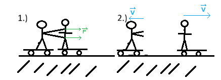

# Newton's laws

## 1. Newton's law

says, that if there isn't any force influencing the body, then it's staying still or moving at constant speed. Eg. we have a moving ball on a board, it's eventualy gonna stop because of friction (of the board and the air).

## 2. Newton's law

says, that everyting, that is accelerating, there is a force involved. The equation is:

$$
\boxed{\vec{F}=m\vec{a}}
$$

## 3. Newton's law

says, that if one body applies force on other, then the other body is gonna apply equal force in the oposit direction. This may sound confusing, but best way how to imagine this is trough a expermient. Imagine 2 people on skateboard and one of them is gonna push the other one, the thing is, that even the one who pushed the other is gonna move.

