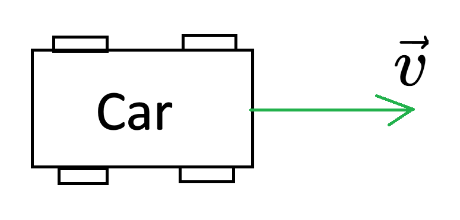

# Vectors in physics

You can imagine a vector as a arrow, that has length and direction. Some physical quantities require more than one information. Mass only needs one, but velocity needs two, because when you have a car moving, you need the value how fast is the car moving or a **magnitude** and the **direction** towards where is it moving. Vectors are displayed as a letter with a arrow over, for example this is the velocity vector: $\vec{v}$.  

